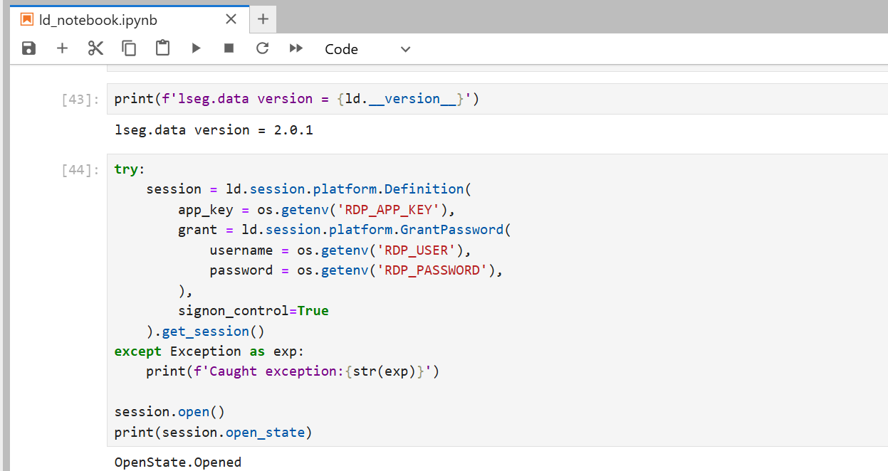
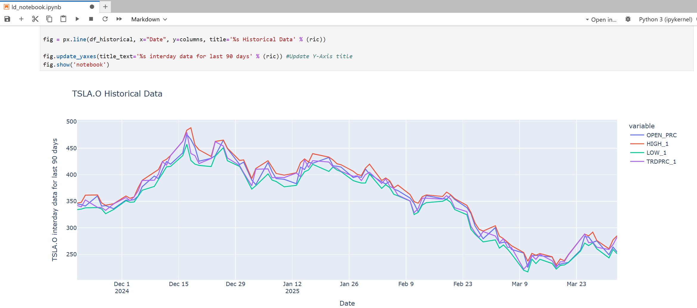
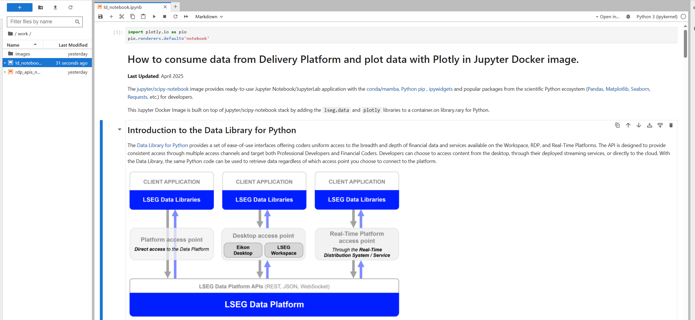

# How to set up and run Data Science Development Environment with Jupyter on Docker
- version: 1.5
- Last update: April 2025
- Environment: Windows
- Prerequisite: [Access to RDP credentials](#prerequisite)

## <a id="table"></a>Table of Contents
* [Introduction](#intro_0)
* [Introduction to Jupyter Docker Stacks](#intro)
* [Running the Jupyter Docker Scipy-Notebook Image](#scipy_notebook)
* [How to use other Python Libraries](#scipy_install_libs)
* [Running the Jupyter Docker R-Notebook Image](#r_notebook_intro)
* [How to use other R Libraries](#r_install_libs)
* [What if I use Eikon Data API](#dapi_usercase)
* [Demo prerequisite](#prerequisite)
* [How to run the Examples](#how_to_run)
* [Conclusion](#conclusion)
* [References](#references)
* [GitHub](#github)

## <a id="intro_0"></a>Introduction

**Last Updated**: April 2025

**Update April 2025**: This article are outdated. There is a new and improve [LSEG Data Library for Python](https://developers.lseg.com/en/api-catalog/lseg-data-platform/lseg-data-library-for-python) (aka Data Library version 2) available now. Please see the [Essential Guide to the Data Libraries - Generations of Python library (EDAPI, RDP, RD, LD)](https://developers.lseg.com/en/article-catalog/article/essential-guide-to-the-data-libraries) article for more detail.

The Data Scientists and Financial coders need to interact with various Data Science/Financial development tools such as the [Anaconda](https://www.anaconda.com/) (or [Miniconda](https://docs.conda.io/en/latest/miniconda.html)) Python distribution platform, the [Python programming language](https://www.python.org/), the [R programming language](https://www.r-project.org/), [Matplotlib library](https://matplotlib.org/), [Pandas Library](https://pandas.pydata.org/), the [Jupyter](https://jupyter.org/) application, and much more.

One of the hardest parts of being Data Developers is the step to set up those tools. You need to install a lot of software and libraries in the correct order to set up your Data Science development environment. The example steps are the following:

1. Install Python or Anaconda/Miniconda
2. Create a new virtual environment (It is not recommended to install programs into your base environment)
3. Install Jupyter
4. Install Data Science libraries such as Matplotlib, Pandas, Plotly, Bokeh, etc.
5. If you are using R, install R and then its libraries 
6. If you are using Julia, Install Julia and then its libraries
7. ... So on.

If you need to share your code/project with your peers, the task to replicate the above steps in your collogues environment is very complex too.

The good news is you can reduce the effort to set up the workbench with the [Docker](https://www.docker.com/) containerization platform. You may think Docker is for the DevOps or the hardcore Developers only, but the [Jupyter Docker Stacks](https://jupyter-docker-stacks.readthedocs.io/en/latest/index.html) simplifies how to create a ready-to-use Jupyter application with Data Science/Financial libraries in a few commands. 

This project demonstrates how to set up Jupyter Notebook environment with Docker to consume and display financial data from Delivery Platform without the need to install the steps above. The project covers both Python and R programming languages. 

## <a id="intro"></a>Introduction to Jupyter Docker Stacks

The [Jupyter Docker Stacks](https://jupyter-docker-stacks.readthedocs.io/en/latest/index.html) are a set of ready-to-run Docker images containing Jupyter applications and interactive computing tools with build-in scientific, mathematical and data analysis libraries pre-installed. With Jupyter Docker Stacks, the setup environment part is reduced to just the following steps:
1. [Install Docker](https://docs.docker.com/get-docker/) and sign up for [DockerHub](https://hub.docker.com/) website (free).
2. Run a command to pull an image that contains Jupyter and preinstalled packages based on the image type.
3. Work with your notebook file
4. If you need additional libraries that are not preinstalled with the image, you can create your image with a Dockerfile to install those libraries.

Docker also helps the team share the development environment by letting your peers replicate the same environment easily. You can share the notebooks, Dockerfile, dependencies-list files with your colleagues, then they just run one or two commands to run the same environment.

Jupyter Docker Stacks provide various images for developers based on their requirement such as:
- [jupyter/scipy-notebook](https://jupyter-docker-stacks.readthedocs.io/en/latest/using/selecting.html#jupyter-scipy-notebook): Jupyter Notebook/JupyterLab with [conda](https://github.com/conda/conda)/[mamba](https://github.com/mamba-org/mamba) , [ipywidgets](https://ipywidgets.readthedocs.io/en/stable/) and popular packages from the scientific Python ecosystem ([Pandas](https://pandas.pydata.org/), [Matplotlib](https://matplotlib.org/), [Seaborn](https://seaborn.pydata.org/), [Requests](https://docs.python-requests.org/en/master/), etc.)
- [jupyter/r-notebook](https://jupyter-docker-stacks.readthedocs.io/en/latest/using/selecting.html#jupyter-r-notebook): Jupyter Notebook/JupyterLab wit R interpreter, IRKernel and [devtools](https://cran.r-project.org/web/packages/devtools/index.html).
- [jupyter/datascience-notebook](https://jupyter-docker-stacks.readthedocs.io/en/latest/using/selecting.html#jupyter-datascience-notebook): Everything in *jupyter/scipy-notebook* and *jupyter/r-notebook* images with Julia support.
- [jupyter/tensorflow-notebook](https://jupyter-docker-stacks.readthedocs.io/en/latest/using/selecting.html#jupyter-tensorflow-notebook): Everything in *jupyter/scipy-notebook* image with [TensorFlow](https://www.tensorflow.org/).

Please see more detail about all image types on [Selecting an Image](https://jupyter-docker-stacks.readthedocs.io/en/latest/using/selecting.html#selecting-an-image) page.

## <a id="scipy_notebook"></a>Running the Jupyter Docker Scipy-Notebook Image

You can run the following command to pull a jupyter/scipy-notebook image (I am demonstrating with [jupyter/scipy-notebook:python-3.11.6 digest - bf4de44b0fa8](https://hub.docker.com/layers/jupyter/scipy-notebook/python-3.11.6/images/sha256-bf4de44b0fa8a422ebc325e695d572d304bd290c055e028a6507921a294213bc) image) and starts a container running a JupyterLab server in your machine.

```bash
docker run -p 8888:8888 --name notebook -v <your working directory>:/home/jovyan/work -it jupyter/scipy-notebook:python-3.11.6
```
The above command set the following container's options:

- ```-p 8888:8888```: Exposes the server on host port 8888
- ```-v <your working directory>:/home/jovyan/work```: Mounts the working directory on the host as **/home/jovyan/work** folder in the container to save the files between your host machine and a container.
- ```--name notebook```: Define a container name as *notebook*
- ```-it```: enable interactive mode with a pseudo-TTY when running a container
- ```--env-file .env```: Pass a ```.env``` file to a container.

*Note*:

- Docker destroys the container and its data when you remove the container, so you always need the [mount volume](https://docs.docker.com/reference/cli/docker/container/run/#volume) (```-v```) option.
- The default notebook username of a container is always **jovyan** (but you can change it to something else).

However, run that long Docker command every time to start JupyterLab environment is not easy. I am using the [Docker Compose](https://docs.docker.com/compose/) to simplify our Docker container process.

Firstly, create a text file name ```docker-compose.yml``` file with the same content as a Docker command above.

```yml
services:
  jupyter:
    image: jupyter/scipy-notebook:python-3.11.6@sha256:fca4bcc9cbd49d9a15e0e4df6c666adf17776c950da9fa94a4f0a045d5c4ad33 
    ports:
      - 8888:8888
    volumes: 
      - <your working directory>:/home/jovyan/work
```

Then run the following command to start a container.

```bash
docker compose up
```

The running result with the notebook server URL information is the following.

 

You can access the JupyterLab application by opening the notebook server URL in your browser. It starts with the */home/jovyan/* location. Please note that only the notebooks and files in the *work* folder can be saved to the host machine (your ```<your working directory>``` folder).

 

The jupyter/scipy-notebook image has built-in useful Python libraries such as [requests](https://docs.python-requests.org/en/master/), [Matplotlib](https://matplotlib.org/), [Pandas](https://pandas.pydata.org/), [NumPy](https://numpy.org/), etc for you. 

 

The files in ```<your working directory>``` folder will be available in the JupyterLab application the next time you start a container, so you can work with your files as a normal JupyterLab/Anaconda environment.

To stop the container, just press ```docker compose down``` command to stop and delete the container.

### <a id="rdpapis_esg"></a>Requesting ESG Data from LSEG Delivery Platform

The jupyter/scipy-notebook image is suitable for building a notebook or dashboard with the Delivery Platform (RDP APIs) content. You can request data from LSEG Delivery Platform
 with the HTTP library, perform data analysis and then plot a graph with built-in Python libraries.

#### <a id="whatis_rdp"></a>What is Delivery Platform APIs?

The [Delivery/Data Platform (RDP) APIs](https://developers.lseg.com/en/api-catalog/refinitiv-data-platform/refinitiv-data-platform-apis) provide various LSEG data and content for developers via easy to use Web-based API.

RDP APIs give developers seamless and holistic access to all of the LSEG content such as Historical Pricing, Environmental Social and Governance (ESG), News, Research, etc and commingled with their content, enriching, integrating, and distributing the data through a single interface, delivered wherever they need it.  The RDP APIs delivery mechanisms are the following:

- Request - Response: RESTful web service (HTTP GET, POST, PUT or DELETE) 
- Alert: delivery is a mechanism to receive asynchronous updates (alerts) to a subscription. 
- Bulks:  deliver substantial payloads, like the end-of-day pricing data for the whole venue. 
- Streaming: deliver real-time delivery of messages.

This example project is focusing on the Request-Response: RESTful web service delivery method only.  

For more detail regarding the Platform, please see the following APIs resources: 
- [Quick Start](https://developers.lseg.com/en/api-catalog/refinitiv-data-platform/refinitiv-data-platform-apis/quick-start) page.
- [Tutorials](https://developers.lseg.com/en/api-catalog/refinitiv-data-platform/refinitiv-data-platform-apis/tutorials) page.
- [RDP APIs: Introduction to the Request-Response API](https://developers.lseg.com/en/api-catalog/refinitiv-data-platform/refinitiv-data-platform-apis/tutorials#introduction-to-the-request-response-api) page.
- [RDP APIs: Authorization - All about tokens](https://developers.lseg.com/en/api-catalog/refinitiv-data-platform/refinitiv-data-platform-apis/tutorials#authorization-all-about-tokens) page.

The example notebook of this scenario is the *rdp_apis_notebook.ipynb* example notebook file in */python/notebook/* folder. The notebook workflow is identical to the example notebook on [my dotenv repository](https://https://github.com/LSEG-API-Samples.lseg.com/en/Article.RDP.RRTO.Python.Java.DOTENV).  

To run this *rdp_apis_notebook.ipynb* example notebook, you just create a ```.env``` file in */python/* folder with the RDP credentials and endpoints information like a template on ```.env.example``` file.

```ini
# RDP Core Credentials
RDP_USER=RDP_MACHINE_ID
RDP_PASSWORD=RDP_PASSWORD   
RDP_APP_KEY=RDP_APP_KEY

# RDP Core Endpoints
RDP_BASE_URL=https://api.refinitiv.com
RDP_AUTH_URL=/auth/oauth2/v1/token
RDP_ESG_URL=/data/environmental-social-governance/v2/views/scores-full
RDP_HISTORICAL_PRICE_URL=/data/historical-pricing/v1
RDP_HISTORICAL_INTERDAY_SUMMARIES_URL=/views/interday-summaries/
RDP_HISTORICAL_EVENT_URL=/views/events/
```

To apply the newly created ```.env``` file to Docker container, add [env_file](https://docs.docker.com/compose/how-tos/environment-variables/set-environment-variables/#use-the-env_file-attribute) attribute to the ```docker-compose.yml``` file.

```yml
services:
  jupyter:
    image: jupyter/scipy-notebook:python-3.11.6@sha256:fca4bcc9cbd49d9a15e0e4df6c666adf17776c950da9fa94a4f0a045d5c4ad33 
    ports:
      - 8888:8888
    volumes: 
      - <project /python/notebook/ directory>:/home/jovyan/work
    env_file:
      - .env
```

And start a container with ```docker compose up``` command.

The command above starts a container and mounted project */python/notebook/* folder to container's */home/jovyan/work* directory. Once you have opened the notebook server URL in a web browser, the *rdp_apis_notebook.ipynb* example notebook will be available in the *work* directory of the Jupyter. The *rdp_apis_notebook.ipynb* example notebook uses the built-in [requests](https://requests.readthedocs.io/en/latest/) libraries in the image to authenticate with the RDP Auth Service and request Environmental Social and Governance (ESG) data from RDP ESG Service to plot a graph. You can run through each step of the notebook. All activities you have done with the file will be saved for a later run too.

Please see the full detail regarding how to run this example notebook on the [How to run the Jupyter Docker Scipy-Notebook](#scipy_notebook_run) section.

 


## <a id="scipy_install_libs"></a>How to use other Python Libraries

**Last Updated**: April 2025

**Update April 2025**: This article are outdated. There is a new and improve [LSEG Data Library for Python](https://developers.lseg.com/en/api-catalog/lseg-data-platform/lseg-data-library-for-python) (aka Data Library version 2) available now. Please see the [Essential Guide to the Data Libraries - Generations of Python library (EDAPI, RDP, RD, LD)](https://developers.lseg.com/en/article-catalog/article/essential-guide-to-the-data-libraries) article for more detail.

If you are using the libraries that do not come with the jupyter/scipy-notebook Docker image such as the [Plotly Python library ](https://plotly.com/python/), you can install them directly via the notebook shell with both pip and conda/mamba tools.

Example with pip:

```python
import sys

!$sys.executable -m pip install plotly
```
Example with conda:

```python
import sys

!conda install --yes --prefix {sys.prefix} plotly
```
However, this solution installs the package into the currently-running Jupyter kernel which is always destroyed every time you stop a Docker container. A better solution is to create a new Docker image from Jupyter Docker Stacks that contains the required libraries, and then all containers generated from the image can use the libraries without any manual installation. You can share ```Dockerfile```, ```docker-compose.yml```, and all configuration files to your peer to create the same environment too.

The Jupyter Docker Stacks let developers create their Dockerfile with an instruction to install the Python dependencies via mamba, pip, and conda package management tools. Please see more detail on the [Using mamba install or pip install in a Child Docker image](https://jupyter-docker-stacks.readthedocs.io/en/latest/using/recipes.html#using-mamba-install-or-pip-install-in-a-child-docker-image) page.

### <a id="rdplib_plotly"></a>Example with LSEG data via Data Library and Plotly

Let's demonstrate with the [LSEG Data Library beta](https://developers.lseg.com/en/api-catalog/lseg-data-platform/lseg-data-library-for-python) (Data Library version 2) and Plotly libraries. 

### <a id="rdp_lib"></a>Introduction to the Data Library for Python

My next point is what is the Data Library. The [Data Library for Python](https://developers.lseg.com/en/api-catalog/lseg-data-platform/lseg-data-library-for-python) provides a set of ease-of-use interfaces offering coders uniform access to the breadth and depth of financial data and services available on the Workspace, RDP, and Real-Time Platforms. The API is designed to provide consistent access through multiple access channels and target both Professional Developers and Financial Coders. Developers can choose to access content from the desktop, through their deployed streaming services, or directly to the cloud. With the Data Library, the same Python code can be used to retrieve data regardless of which access point you choose to connect to the platform.

 

The Data Library are available in the following programming languages:

- [Python](https://developers.lseg.com/en/api-catalog/lseg-data-platform/lseg-data-library-for-python)
- [.NET](https://developers.lseg.com/en/api-catalog/lseg-data-platform/lseg-data-library-for-net)
- [TypeScript](https://developers.lseg.com/en/api-catalog/refinitiv-data-platform/refinitiv-data-library-for-typescript)

For more deep detail regarding the Data Library for Python, please refer to the following articles and tutorials:

- [Quickstart](https://developers.lseg.com/en/api-catalog/lseg-data-platform/lseg-data-library-for-python/quick-start).
- [Documentation](https://developers.lseg.com/en/api-catalog/lseg-data-platform/lseg-data-library-for-python/documentation).
- [Tutorials](https://developers.lseg.com/en/api-catalog/lseg-data-platform/lseg-data-library-for-python/tutorials).
- [GitHub](https://github.com/LSEG-API-Samples/Example.DataLibrary.Python).

#### Disclaimer

This project is based on Data Library Python versions **2.0.1** using the Platform Session only.

### How to create new Jupyter Docker Image for Data Library and Plotly

Firstly create a ```requirements.txt``` file in a */python/* folder with the following content:

```ini
plotly==6.0.1
lseg-data==2.0.1
anywidget==0.9.18
```

Please be noticed that you do not need to specify ```jupyterlab``` dependencies.

Next, create a ```Dockerfile``` file in a */python/* folder with the following content:

```ini
# Start from a core stack version
FROM jupyter/scipy-notebook:python-3.11.6

LABEL maintainer="Your name and email address"

# Install from requirements.txt file
COPY --chown=${NB_UID}:${NB_GID} requirements.txt /tmp/
RUN pip install --quiet --no-cache-dir --requirement /tmp/requirements.txt && \
    fix-permissions "${CONDA_DIR}" && \
    fix-permissions "/home/${NB_USER}"
```

Now we come to a ```docker-compose.yml``` file, we need to update it to build and run local image from a ```Dockerfile``` above.

```yml
services:
  jupyter:
    build:
      dockerfile: Dockerfile 
    ports:
      - 8888:8888
    volumes: 
      - <project /python/notebook/ directory>:/home/jovyan/work
    env_file:
      - .env
```

And then build and run this image with the following command

```bash
docker compose up
```

Once the Docker image is built successfully, you can the following command to starts a container running a Jupyter Notebook server with all Python libraries that are defined in a ```requirements.txt``` file and *jupyter/scipy-notebook* in your machine.


 

Please noticed that all credentials have been passed to the Jupyter server's environment variables via Docker run ```-env-file .env``` option, so the notebook can access those configurations via ```os.getenv()``` method. Developers do not need to keep credentials information in the notebook source code.

Then you can start to create notebook applications that consume content from LSEG with the Data Library API, and then plot data with the Plotly library. Please see more detail in the *ld_notebook.ipynb* example notebook file in */python/notebook/* folder. Please see the full detail regarding how to run this example notebook on the [How to build and run the Jupyter Docker Scipy-Notebook customize's image with RDP Library for Python and Plotly](#scipy_notebook_build) section.

 

 

**Caution**: You *should add* ```.env``` (and ```.env.example```), Jupyter checkpoints, cache, config, etc. file to the ```.dockerignore``` file to avoid adding them to a public Docker Hub repository.


## <a id="dapi_usercase"></a>What if I use a Desktop Session

If you are using the Data library with a Desktop Session, the Jupyter Docker Stacks are not for you. The Workspace application integrates a Data API proxy that acts as an interface between the library and the Workspace Platform. For this reason, the Workspace application must be running in the same machine that running Data Library application, and the Workspace desktop application does not support Docker.

However, you can access the [*CodeBook*](https://www.refinitiv.com/en/products/codebook), the cloud-hosted Jupyter Notebook development environment for Python scripting from the application. The CodeBook is natively available in Workspace as an app (**no installation required!!**), providing access to LSEG APIs and other popular Python libraries that are already pre-installed on the cloud. The list of pre-installed libraries is available in the Codebook's *Libraries&Extensions.md* file.


 

## <a id="prerequisite"></a>Demo prerequisite

This example requires the following dependencies software and libraries.

1. RDP Access credentials.
2. [Docker Desktop/Engine](https://docs.docker.com/get-docker/).
3. [DockerHub](https://hub.docker.com/) account.
4. Internet connection. 

Please contact your LSEG's representative to help you to access the RDP account and services. You can find more detail regarding the RDP access credentials set up from the *Getting Started for User ID* section of [Getting Start with Data Platform article](https://developers.lseg.com/en/article-catalog/article/getting-start-with-refinitiv-data-platform) article:

##  <a id="project_files"></a>Project files

This example project contains the following files and folders

1. *python/* folder: The Jupyter Notebook for RDP APIs/RDP Library for Python with jupyter scipy-notebook, contains example notebooks, configurations, and Docker files.
2. *.env.example*: The example of ```.env``` file structure.
3. *images*: Project images folder.
4. *LICENSE.md*: Project's license file.
5. *README.md*: Project's README file.

## <a id="how_to_run"></a>How to run the Examples

The first step is to unzip or download the example project folder into a directory of your choice, then set up Python or R Docker environments based on your preference.

**Caution**: You *should not* share a ```.env``` file to your peers or commit/push it to the version control. You should add the file to the ```.gitignore``` file to avoid adding it to version control or public repository accidentally.

### <a id="scipy_notebook_run"></a>How to run the Jupyter Docker Scipy-Notebook

1. Firstly, open the project folder in the command prompt and go to the *python* subfolder
2. Create a file name ```.env``` in that folder with the following content:

    ```ini
    # RDP Core Credentials
    RDP_USER=<Your RDP User>
    RDP_PASSWORD=<Your RDP Password>
    RDP_APP_KEY=<Your RDP App Key>

    # RDP Core Endpoints
    RDP_BASE_URL=https://api.refinitiv.com
    RDP_AUTH_URL=/auth/oauth2/v1/token
    RDP_ESG_URL=/data/environmental-social-governance/v2/views/scores-full
    ```
3. Run the following command in a command prompt to pull Jupyter Docker Scipy-Notebook image and run its container

    ```bash
    docker compose up
    ```

4. The Jupyter Docker Scipy-Notebook will run the Jupyter server and print the server URL in a console. 
5. Open the notebook server URL in your browser, the web browser will start the JupyterLab application.
6. Open the work folder and open *rdp_apis_notebook.ipynb* example notebook file, then run through each notebook cell.

     

7. Open the work folder and open *ld_notebook.ipynb* example notebook file, then run through each notebook cell.

    

## <a id="conclusion"></a>Conclusion

Docker is an open containerization platform for developing, testing, deploying, and running any software application. The Jupyter Docker Stacks provide a ready-to-use and consistent development environment for Data Scientists, Financial coders, and their teams. Developers do not need to set up their environment/workbench (Anaconda, Virtual Environment, Jupyter installation, etc.) manually which is the most complex task for them anymore. Developers can just run a single command to start the Jupyter notebook server from Jupyter Docker Stacks and continue their work.

The Jupyter Docker Stacks already contain a handful of libraries for Data Science/Financial development for various requirements (Python, R, Machine Learning, and much more). If developers need additional libraries, Jupyter Docker Stacks let developers create their Dockerfile with an instruction to install those dependencies. All containers generated from the customized image can use the libraries without any manual installation. 


## <a id="references"></a>References

You can find more details regarding the Data Library beta, Plotly, Jupyter Docker Stacks, and related technologies for this notebook from the following resources:

- [LSEG Data Library for Python](https://developers.lseg.com/en/api-catalog/lseg-data-platform/lseg-data-library-for-python) on the [LSEG Developer Community](https://developers.lseg.com/) website.
- [Essential Guide to the Data Libraries - Generations of Python library (EDAPI, RDP, RD, LD)](https://developers.lseg.com/en/article-catalog/article/essential-guide-to-the-data-libraries) article.
- [Data Library Beta](https://developers.lseg.com/en/api-catalog/refinitiv-data-platform/refinitiv-data-platform-libraries) page.
- [Plotly Official page](https://plotly.com/).
- [Plotly Python page](https://plotly.com/python/).
- [Plotly Express page](https://plotly.com/python/plotly-express/)
- [Plotly Graph Objects page](https://plotly.com/python/graph-objects/)
- [Jupyter Docker Stacks page](https://jupyter-docker-stacks.readthedocs.io/en/latest/index.html)
- [Jupyter Docker Stack on DockerHub](https://hub.docker.com/u/jupyter) website.
- [Setup Jupyter Notebook for R article](https://developers.lseg.com/en/article-catalog/article/setup-jupyter-notebook-r).
- [An Introduction to Docker for R Users](https://colinfay.me/docker-r-reproducibility/).


For any questions related to LSEG APIs, please use the following forums on the [the Developers Community Q&A page](https://community.developers.refinitiv.com/).