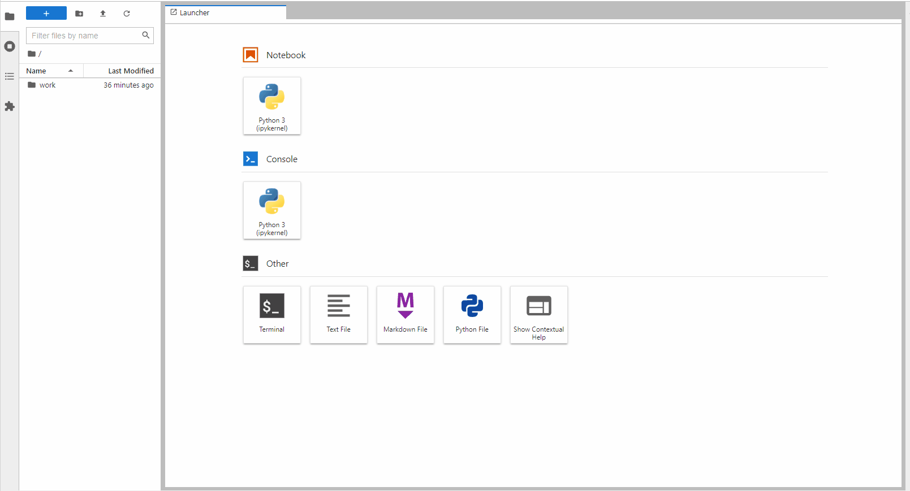
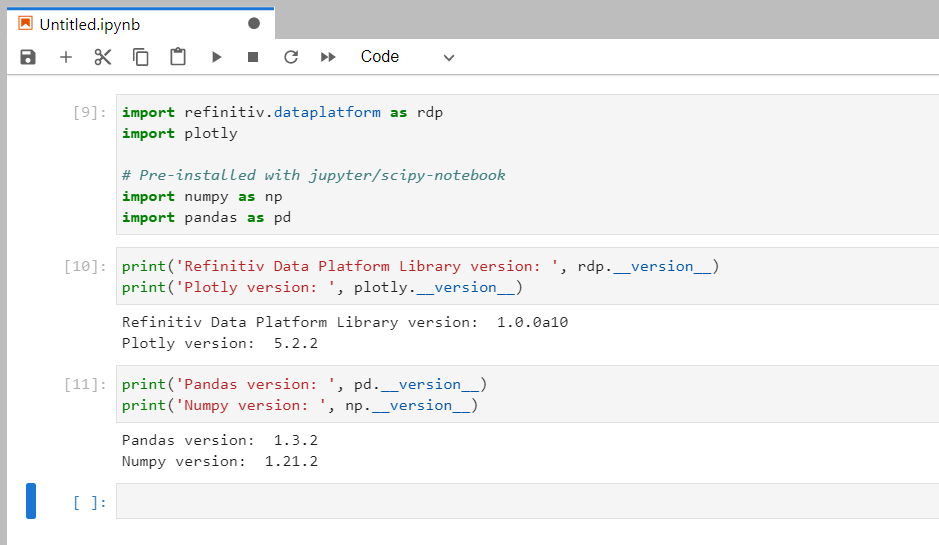
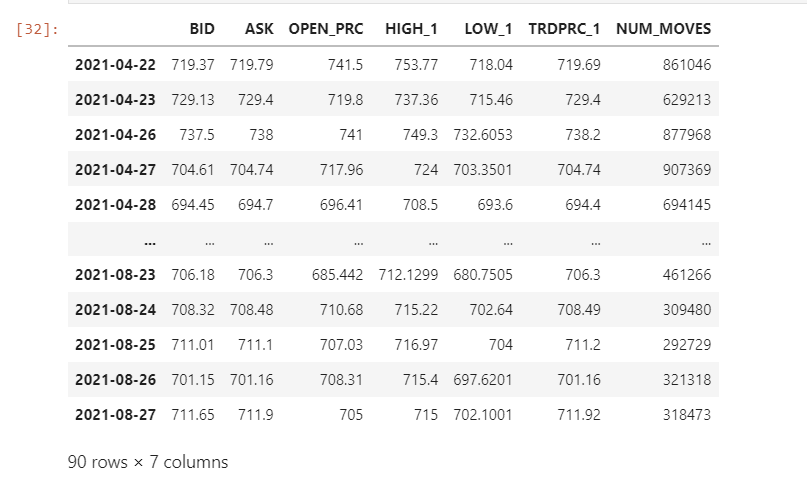
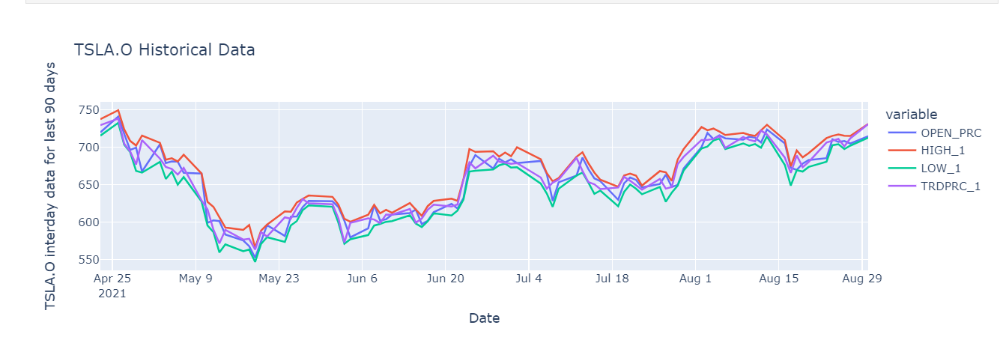

# How to set up and run Data Science Development Environment with Docker

The Data Scientists and Financial coders need to interact with various Data Science/Financial development tools such as the [Anaconda](https://www.anaconda.com/) (or [Miniconda](https://docs.conda.io/en/latest/miniconda.html)) Python distribution platform, the [Python programming language](https://www.python.org/), the [R programming language](https://www.r-project.org/), [Matplotlib library](https://matplotlib.org/), [Pandas Library](https://pandas.pydata.org/), the [Jupyter](https://jupyter.org/) application, and much more.

The steps to set up those tools are complex. You need to install a lot of software and libraries in a correct order to set up your Data Science development environment as the following:
1. Install Python or Anaconda/Miniconda
2. Create a new virtual environment (It is not recommend to install programs into your base environment)
3. Install Jupyter
4. Install Data Science libraries such as Matplotlib, Pandas, Plotly, Bokeh, etc.
5. If you are using R, install R and then its libraries 
6. If you are using Julia, Install Julia and then its libraries
7. ... So on.

If you need to share your code/project with your peers, the task to replicate the above steps in your collogues environment is very complex too.

The good news is you can reduce an effort to set up the workbench with the [Docker](https://www.docker.com/) containerization platform. You may thing Docker is for the DevOps or the hard core Developers only, but the [Jupyter Docker Stacks](https://jupyter-docker-stacks.readthedocs.io/en/latest/index.html) simplifies how to create a read-to-use Jupyter application with Data Science/Financial libraries in a few commands. 

## Introduction to Jupyter Docker Stacks

The [Jupyter Docker Stacks](https://jupyter-docker-stacks.readthedocs.io/en/latest/index.html) are a set of ready-to-run Docker images containing Jupyter applications and interactive computing tools with build in scientific, mathematical and data analysis libraries pre-installed. With Jupyter Docker Stacks, the set up environment part are reduced to just the following steps:
1. Install Docker
2. Run a command to pull image that contains Jupyter and preinstalled packages based on the image type
3. Work with your notebook file
4. If you need additional libraries that are not preinstalled with the image, you can create own image with a Dockerfile to install those libraries.

Docker also help the team share development environment by letting your peers replicate the same environment easily. You can share the notebooks, Dockerfile, dependencies-list files to your colleagues, then they just run one or two commands to run the same environment.

Jupyter Docker Stacks provide various images for developers based on their requirement such as:
- [jupyter/scipy-notebook](https://jupyter-docker-stacks.readthedocs.io/en/latest/using/selecting.html#jupyter-scipy-notebook): Jupyter Notebook/JupyterLab with [conda](https://github.com/conda/conda)/[mamba](https://github.com/mamba-org/mamba) , [ipywidgets](https://ipywidgets.readthedocs.io/en/stable/) and popular packages from the scientific Python ecosystem (Pands, Matplotlib, [Seaborn](https://seaborn.pydata.org/), etc.)
- [jupyter/r-notebook](https://jupyter-docker-stacks.readthedocs.io/en/latest/using/selecting.html#jupyter-r-notebook): Jupyter Notebook/JupyterLab wit R interpreter, IRKernel and [devtools](https://cran.r-project.org/web/packages/devtools/index.html).
- [jupyter/datascience-notebook](https://jupyter-docker-stacks.readthedocs.io/en/latest/using/selecting.html#jupyter-datascience-notebook): Everything in *jupyter/scipy-notebook* and *jupyter/r-notebook* images with Julia support.
- [jupyter/tensorflow-notebook](https://jupyter-docker-stacks.readthedocs.io/en/latest/using/selecting.html#jupyter-tensorflow-notebook): Everything in *jupyter/scipy-notebook* image with [TensorFlow](https://www.tensorflow.org/).

Please see more detail about all image types on [Selecting an Image](https://jupyter-docker-stacks.readthedocs.io/en/latest/using/selecting.html#selecting-an-image) page.

## Running the Jupyter Docker Image

You can run the following command to pull a jupyter/scipy-notebook image (tag *70178b8e48d7*) and starts a container running a Jupyter Notebook server in your machine.

```
docker run -p 8888:8888 --name notebook -v <your working directory>:/home/jovyan/work -e JUPYTER_ENABLE_LAB=yes jupyter/scipy-notebook:70178b8e48d7
```
The above command set the following container's options:
- ```-p 8888:8888```: Exposes the server on host port 8888
- ```-v <your working directory>:/home/jovyan/work```: Mounts the working directory on the host as /home/jovyan/work folder in the container to save the files between your host machine and a container.
- ```-e JUPYTER_ENABLE_LAB=yes```: Run JupyterLab instead of the default classic Jupyter Notebook.
- ```--name notebook```: Define a container name as *notebook*

*Note*:
- Docker destroys the container after notebook server exit, so you always need the ```-v``` option.
- The default's username of a container is always **jovyan** (but you can change it to something else).

The running result with the notebook server URL information is the following.

 

You can access the JupyterLab application by opening the notebook server URL in your browser. It starts with the */home/jovyan/* location. Please note that only the notebooks and files in the *work* folder that can be saved to the host machine (your ```<your working directory>``` folder).

 

The jupyter/scipy-notebook image has built-in useful Python libraries such as [requests](https://docs.python-requests.org/en/master/), Matplotlib, Pandas, [NumPy](https://numpy.org/), etc for you. 

 

The files in ```<your working directory>``` folder will be available in the JupyterLab application the next time you start a container, so you can work with your files as a normal JupyterLab/Anaconda environment.

To stop the container, just run ```docker stop <container name>``` and ```docker rm <container name>``` commands.

```
docker stop notebook
...
docker rm notebook
```

### Requesting ESG Data from RDP APIs 

The jupyter/scipy-notebook image is suitable for building a notebook or dashboard with the Refinitiv Data Platform APIs (RDP APIs) content. You can request data from RDP APIs with the HTTP library, perform a data analysis and then plot a graph with built-in Python libraries.

#### <a id="whatis_rdp"></a>What is Refinitiv Data Platform (RDP) APIs?

The [Refinitiv Data Platform (RDP) APIs](https://developers.refinitiv.com/en/api-catalog/refinitiv-data-platform/refinitiv-data-platform-apis) provide various Refinitiv data and content for developers via easy to use Web-based API.

RDP APIs give developers seamless and holistic access to all of the Refinitiv content such as Historical Pricing, Environmental Social and Governance (ESG), News, Research, etc and commingled with their content, enriching, integrating, and distributing the data through a single interface, delivered wherever they need it.  The RDP APIs delivery mechanisms are the following:
* Request - Response: RESTful web service (HTTP GET, POST, PUT or DELETE) 
* Alert: delivery is a mechanism to receive asynchronous updates (alerts) to a subscription. 
* Bulks:  deliver substantial payloads, like the end-of-day pricing data for the whole venue. 
* Streaming: deliver real-time delivery of messages.

This example project is focusing on the Request-Response: RESTful web service delivery method only.  

For more detail regarding Refinitiv Data Platform, please see the following APIs resources: 
- [Quick Start](https://developers.refinitiv.com/en/api-catalog/refinitiv-data-platform/refinitiv-data-platform-apis/quick-start) page.
- [Tutorials](https://developers.refinitiv.com/en/api-catalog/refinitiv-data-platform/refinitiv-data-platform-apis/tutorials) page.
- [RDP APIs: Introduction to the Request-Response API](https://developers.refinitiv.com/en/api-catalog/refinitiv-data-platform/refinitiv-data-platform-apis/tutorials#introduction-to-the-request-response-api) page.
- [RDP APIs: Authorization - All about tokens](https://developers.refinitiv.com/en/api-catalog/refinitiv-data-platform/refinitiv-data-platform-apis/tutorials#authorization-all-about-tokens) page.

Lets demonstrates with the *rdp_apis_notebook.ipynb* example notebook file in */python/notebook/* folder. The notebook workflow is identical to the example notebook on [my dotenv repository](https://github.com/Refinitiv-API-Samples/Article.RDP.RRTO.Python.Java.DOTENV). 

Firstly, create a ```.env``` file in */python/* folder with the following content:

```
# RDP Core Credentials
RDP_USER=<Your RDP User>
RDP_PASSWORD=<Your RDP Password>
RDP_APP_KEY=<Your RDP App Key>

# RDP Core Endpoints
RDP_BASE_URL=https://api.refinitiv.com
RDP_AUTH_URL=/auth/oauth2/v1/token
RDP_ESG_URL=/data/environmental-social-governance/v2/views/scores-full
```

**Caution**: You *should not* share this ```.env``` file to your peers or commit/push it to the version control. You should add the file to the ```.gitignore``` file to avoid adding it to version control or public repository accidentally.

Then run jupyter/scipy-notebook image to start a Jupyter server with the following command in */python/* folder.:

```
docker run -p 8888:8888 --name notebook -v <project /python/notebook/ directory>:/home/jovyan/work -e JUPYTER_ENABLE_LAB=yes --env-file .env jupyter/scipy-notebook:70178b8e48d7
```

The above command started a container name *notebook* and mounted */python/notebook/* folder to container's */home/jovyan/work* directory. Once you have opened the notebook server URL in a web browser, the *rdp_apis_notebook.ipynb* example notebook will be available in *work* directory of the Jupyter. The rdp_apis_notebook.ipynb example notebook uses the built-in libraries in image to authenticate with the RDP Auth Service and request Environmental Social and Governance (ESG) data from RDP ESG Service to plot a graph. You can run through each step of the notebook. All activities you have done with the file will be saved for later run too.

 

### How to change Container User

The Jupyter Docker Stacks images are actually a Linux container that runs Jupyter server for you. The default notebook user (```nb_user```) of the Jupyter server is always **jovyan** and the home directory is always **home/jovyan**. However, you can change a notebook user to someone else based on your preference via the following container's options.

```
docker run -e CHOWN_HOME=yes --user root -e NB_USER=<User> <project /python/notebook/ directory>:/<User>/jovyan/work
```

Example with *wasinw* user.

```
docker run -p 8888:8888 --name notebook -e CHOWN_HOME=yes --user root -e NB_USER=wasinw -v C:\drive_d\Project\Code\notebook_docker\python\notebook:/home/wasinw/work -e JUPYTER_ENABLE_LAB=yes --env-file .env jupyter/scipy-notebook:70178b8e48d7
```
Now the notebook user is *wasinw* and the working directory is */home/wasinw/work* folder.

 

Please note that this example project uses *jovyan* as a default notebook user.

### How to use other Python Libraries

If you are using the libraries that do not come with the jupyter/scipy-notebook Docker image such as the [Plotly Python library ](https://plotly.com/python/), you can install them directly via the notebook shell with both pip and conda/mamba tools.

Example with pip:
```
import sys

!$sys.executable -m pip install plotly
```
Example with conda:
```
import sys

!conda install --yes --prefix {sys.prefix} plotly
```
However, this solution installs the package into the currently-running Jupyter kernel which is always destroyed every time you stop a Docker container. A better solution is to create a new Docker image from Jupyter Docker Stacks that contains the required libraries, and then all containers generated from the image can use the libraries without any manual installation. 

The Jupyter Docker Stacks let developers create own Dockerfile with with an instruction to install the Python dependencies via mamba, pip, and conda package management tools. Please see more detail on the [Using mamba install or pip install in a Child Docker image](https://jupyter-docker-stacks.readthedocs.io/en/latest/using/recipes.html#using-mamba-install-or-pip-install-in-a-child-docker-image) page.

#### Example with Refinitiv Data via Refinitiv Data Platform Library and Plotly

Lets demonstrate with the [Refinitiv Data Platform Library for Python](https://developers.refinitiv.com/en/api-catalog/refinitiv-data-platform/refinitiv-data-platform-libraries) (RDP Library for Python) and Plotly libraries. 

#### <a id="rdp_lib"></a>Introduction to Refinitiv Data Platform (RDP) Libraries

Refinitiv provides a wide range of contents and data which require multiple technologies, delivery mechanisms, data formats, and the multiple APIs to access each content. The [RDP Libraries](https://developers.refinitiv.com/en/api-catalog/refinitiv-data-platform/refinitiv-data-platform-libraries) are a suite of ease-of-use interfaces providing unified access to streaming and non-streaming data services offered within the [Refinitiv Data Platform (RDP)](https://developers.refinitiv.com/en/api-catalog/refinitiv-data-platform/refinitiv-data-platform-apis). The Libraries simplified how to access data to various delivery modes such as Request Response, Streaming, Bulk File, and Queues via a single library. 

For more deep detail regarding the RDP Libraries, please refer to the following articles and tutorials:
- [Developer Article: Discover our Refinitiv Data Platform Library part 1](https://developers.refinitiv.com/article/discover-our-upcoming-refinitiv-data-platform-library-part-1).
- [Developer Article: Discover our Refinitiv Data Platform Library part 2](https://developers.refinitiv.com/en/article-catalog/article/discover-our-refinitiv-data-platform-library-part-2).
- [Refinitiv Data Platform Libraries Document: An Introduction page](https://developers.refinitiv.com/en/api-catalog/refinitiv-data-platform/refinitiv-data-platform-libraries/documentation).

##### Disclaimer

As this example project has been tested on alpha versions **1.0.0.a10** of the Python library, the method signatures, data formats, etc are subject to change. 

Firstly create a ```requirements.txt``` file in a */python/* folder with the following content:

```
plotly==5.2.2
refinitiv-dataplatform==1.0.0a10
```

Next, create a ```Dockerfile``` file in a */python/* folder with the following content:

```
# Start from a core stack version
FROM jupyter/scipy-notebook:70178b8e48d7

LABEL maintainer="Your name and email address"

# Install from requirements.txt file
COPY --chown=${NB_UID}:${NB_GID} requirements.txt /tmp/
RUN pip install --quiet --no-cache-dir --requirement /tmp/requirements.txt && \
    fix-permissions "${CONDA_DIR}" && \
    fix-permissions "/home/${NB_USER}"

ENV JUPYTER_ENABLE_LAB=yes
```
Please noticed that a Dockerfile set ```ENV JUPYTER_ENABLE_LAB=yes``` environment variable, so all containers that are generated from this image will run the JupyterLab application by default. 

And then build a Docker image name *jupyter_rdp_plotly* with the following command:

```
docker build . -t jupyter_rdp_plotly
```

Once Docker image is built successfully, you can the following command to starts a container running a Jupyter Notebook server with all Python libraries that are defined in a ```requirements.txt``` file and  *jupyter/scipy-notebook* in your machine.

```
docker run -p 8888:8888 --name notebook -v <project /python/notebook/ directory>:/home/jovyan/work -e  --env-file .env jupyter_rdp_plotly
```

 

Then you can start create notebook applications that consume content from Refinitiv with the RDP Library API, and then plot data with the Plotly library.

Example Code: Requesting Tesla Inc (*TSLA.O*) Interday data for the last 90 days.
```
import os
import refinitiv.dataplatform as rdp

# Open RDP Platform Session
session = rdp.open_platform_session(
    os.getenv('RDP_APP_KEY'), 
    rdp.GrantPassword(
        username = os.getenv('RDP_USER'), 
        password = os.getenv('RDP_PASSWORD')
    )
)
session.get_open_state() #<State.Open: 3>

# Use RDP Libraries Function Layer to request time-series data as a Pandas DataFrame object.

universe = 'TSLA.O'
df_historical = rdp.get_historical_price_summaries(
    universe = universe,
    interval = rdp.Intervals.DAILY,
    count = 90,
    fields = ['BID','ASK','OPEN_PRC','HIGH_1','LOW_1','TRDPRC_1','NUM_MOVES']
    )
df_historical
```


Please noticed that all credentials have been passed to the Jupyter server's environment variables via Docker run ```-env-file .env``` option, so the notebook can access those configurations via ```os.getenv()``` method. Developers do not need to keep credentials information in the notebook source code.

Next, you can use the Plotly library to plot multi-lines chart of the Time Series data.

```
import plotly.express as px

# Rename an index column to 'Date'
df_historical.index.name = 'Date'

# DataFrame transformation code
...

# Line Plot with Plotly Express
columns = ['OPEN_PRC','HIGH_1','LOW_1','TRDPRC_1']
fig = px.line(df_historical, x="Date", y=columns, title='%s Historical Data' % (universe))
fig.update_yaxes(title_text='%s interday data for last 90 days' % (universe)) #Update Y-Axis title
fig.show()
```


Please see more detail in the *rdp_library_plotly_example.ipynb* example notebook file.

**Caution**: You *should add* ```.env``` (and ```.env.example```), Jupyter checkpoints, cache, config, etc. file to the ```.dockerignore``` file to avoid adding them to a public Docker Hub repository.

You *should not* share this ```.env``` file to your peers or commit/push it to the version control. You should add the file to the ```.gitignore``` file to avoid adding it to version control or public repository accidentally.


## <a id="references"></a>References

You can find more details regarding the Refinitiv Data Platform Libraries, Plotly, Jupyter Docker Stacks, and related technologies for this notebook from the following resources:
* [Refinitiv Data Platform (RDP) Libraries](https://developers.refinitiv.com/en/api-catalog/refinitiv-data-platform/refinitiv-data-platform-libraries) on the [Refinitiv Developer Community](https://developers.refinitiv.com/) website.
* [RDP Libraries Quick Start Guide page](https://developers.refinitiv.com/en/api-catalog/refinitiv-data-platform/refinitiv-data-platform-libraries/quick-start).
* [RDP Libraries Tutorial page](https://developers.refinitiv.com/en/api-catalog/refinitiv-data-platform/refinitiv-data-platform-libraries/tutorials).
* [Discover our Refinitiv Data Platform Library (part 1)](https://developers.refinitiv.com/en/article-catalog/article/discover-our-refinitiv-data-platform-library-part-1).
* [Discover our Refinitiv Data Platform Library (part 2)](https://developers.refinitiv.com/en/article-catalog/article/discover-our-refinitiv-data-platform-library-part-2).
* [Plotly Official page](https://plotly.com/).
* [Plotly Python page](https://plotly.com/python/).
* [Plotly Express page](https://plotly.com/python/plotly-express/)
* [Plotly Graph Objects page](https://plotly.com/python/graph-objects/)
* [Jupyter Dokcer Stacks page](https://jupyter-docker-stacks.readthedocs.io/en/latest/index.html)
* [Jupyter Dokcer Stack on DockerHub](https://hub.docker.com/u/jupyter) website

For any questions related to Refinitiv Data Platform or Refinitiv Data Platform Libraries, please use the following forums on the [the Developers Community Q&A page](https://community.developers.refinitiv.com/).
- [RDP APIs Forum](https://community.developers.refinitiv.com/spaces/231/index.html).
- [Refinitiv Data Platform Libraries Forum](https://community.developers.refinitiv.com/spaces/321/refinitiv-data-platform-libraries.html).