# How to set up and run Data Science Development Environment with Jupyter on Docker
- version: 1.0
- Last update: Sep 2021
- Environment: Windows
- Prerequisite: [Access to RDP credentials](#prerequisite)

## <a id="table"></a>Table of Contents
* [Introduction](#intro_0)
* [Introduction to Jupyter Docker Stacks](#intro)
* [Running the Jupyter Docker Scipy-Notebook Image](#scipy_notebook)
* [How to use other Python Libraries](#scipy_install_libs)
* [Running the Jupyter Docker R-Notebook Image](#r_notebook_intro)
* [How to use other R Libraries](#r_install_libs)
* [What if I use Eikon Data API](#dapi_usercase)
* [Demo prerequisite](#prerequisite)
* [How to run the Examples](#how_to_run)
* [Conclusion](#conclusion)
* [References](#references)
* [GitHub](#github)

## <a id="intro_0"></a>Introduction

The Data Scientists and Financial coders need to interact with various Data Science/Financial development tools such as the [Anaconda](https://www.anaconda.com/) (or [Miniconda](https://docs.conda.io/en/latest/miniconda.html)) Python distribution platform, the [Python programming language](https://www.python.org/), the [R programming language](https://www.r-project.org/), [Matplotlib library](https://matplotlib.org/), [Pandas Library](https://pandas.pydata.org/), the [Jupyter](https://jupyter.org/) application, and much more.

One of the hardest parts of being Data Developers is the step to set up those tools. You need to install a lot of software and libraries in the correct order to set up your Data Science development environment. The example steps are the following:
1. Install Python or Anaconda/Miniconda
2. Create a new virtual environment (It is not recommended to install programs into your base environment)
3. Install Jupyter
4. Install Data Science libraries such as Matplotlib, Pandas, Plotly, Bokeh, etc.
5. If you are using R, install R and then its libraries 
6. If you are using Julia, Install Julia and then its libraries
7. ... So on.

If you need to share your code/project with your peers, the task to replicate the above steps in your collogues environment is very complex too.

The good news is you can reduce the effort to set up the workbench with the [Docker](https://www.docker.com/) containerization platform. You may think Docker is for the DevOps or the hardcore Developers only, but the [Jupyter Docker Stacks](https://jupyter-docker-stacks.readthedocs.io/en/latest/index.html) simplifies how to create a ready-to-use Jupyter application with Data Science/Financial libraries in a few commands. 

This project demonstrates how to set up Jupyter Notebook environment with Docker to consume and display financial data from Refinitiv Data Platform without the need to install the steps above. The project covers both Python and R programming languages. 

## <a id="intro"></a>Introduction to Jupyter Docker Stacks

The [Jupyter Docker Stacks](https://jupyter-docker-stacks.readthedocs.io/en/latest/index.html) are a set of ready-to-run Docker images containing Jupyter applications and interactive computing tools with build-in scientific, mathematical and data analysis libraries pre-installed. With Jupyter Docker Stacks, the setup environment part is reduced to just the following steps:
1. [Install Docker](https://docs.docker.com/get-docker/) and sign up for [DockerHub](https://hub.docker.com/) website (free).
2. Run a command to pull an image that contains Jupyter and preinstalled packages based on the image type.
3. Work with your notebook file
4. If you need additional libraries that are not preinstalled with the image, you can create your image with a Dockerfile to install those libraries.

Docker also helps the team share the development environment by letting your peers replicate the same environment easily. You can share the notebooks, Dockerfile, dependencies-list files with your colleagues, then they just run one or two commands to run the same environment.

Jupyter Docker Stacks provide various images for developers based on their requirement such as:
- [jupyter/scipy-notebook](https://jupyter-docker-stacks.readthedocs.io/en/latest/using/selecting.html#jupyter-scipy-notebook): Jupyter Notebook/JupyterLab with [conda](https://github.com/conda/conda)/[mamba](https://github.com/mamba-org/mamba) , [ipywidgets](https://ipywidgets.readthedocs.io/en/stable/) and popular packages from the scientific Python ecosystem ([Pandas](https://pandas.pydata.org/), [Matplotlib](https://matplotlib.org/), [Seaborn](https://seaborn.pydata.org/), [Requests](https://docs.python-requests.org/en/master/), etc.)
- [jupyter/r-notebook](https://jupyter-docker-stacks.readthedocs.io/en/latest/using/selecting.html#jupyter-r-notebook): Jupyter Notebook/JupyterLab wit R interpreter, IRKernel and [devtools](https://cran.r-project.org/web/packages/devtools/index.html).
- [jupyter/datascience-notebook](https://jupyter-docker-stacks.readthedocs.io/en/latest/using/selecting.html#jupyter-datascience-notebook): Everything in *jupyter/scipy-notebook* and *jupyter/r-notebook* images with Julia support.
- [jupyter/tensorflow-notebook](https://jupyter-docker-stacks.readthedocs.io/en/latest/using/selecting.html#jupyter-tensorflow-notebook): Everything in *jupyter/scipy-notebook* image with [TensorFlow](https://www.tensorflow.org/).

Please see more detail about all image types on [Selecting an Image](https://jupyter-docker-stacks.readthedocs.io/en/latest/using/selecting.html#selecting-an-image) page.

## <a id="scipy_notebook"></a>Running the Jupyter Docker Scipy-Notebook Image

You can run the following command to pull a jupyter/scipy-notebook image (tag *70178b8e48d7*) and starts a container running a Jupyter Notebook server in your machine.

```
docker run -p 8888:8888 --name notebook -v <your working directory>:/home/jovyan/work -e JUPYTER_ENABLE_LAB=yes -it jupyter/scipy-notebook:70178b8e48d7
```
The above command set the following container's options:
- ```-p 8888:8888```: Exposes the server on host port 8888
- ```-v <your working directory>:/home/jovyan/work```: Mounts the working directory on the host as /home/jovyan/work folder in the container to save the files between your host machine and a container.
- ```-e JUPYTER_ENABLE_LAB=yes```: Run JupyterLab instead of the default classic Jupyter Notebook.
- ```--name notebook```: Define a container name as *notebook*
- ```-it```: enable interactive mode with a pseudo-TTY when running a container

*Note*:
- Docker destroys the container and its data when you remove the container, so you always need the ```-v``` option.
- The default notebook username of a container is always **jovyan** (but you can change it to something else).

The running result with the notebook server URL information is the following.

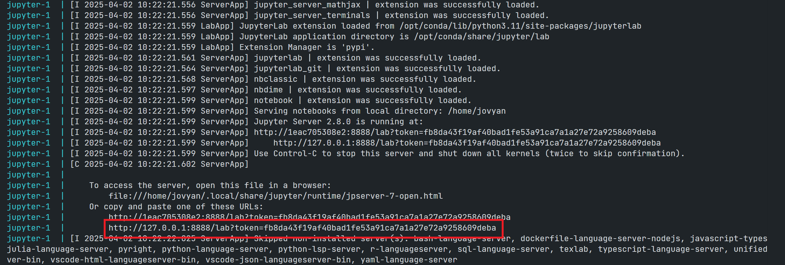 

You can access the JupyterLab application by opening the notebook server URL in your browser. It starts with the */home/jovyan/* location. Please note that only the notebooks and files in the *work* folder can be saved to the host machine (your ```<your working directory>``` folder).

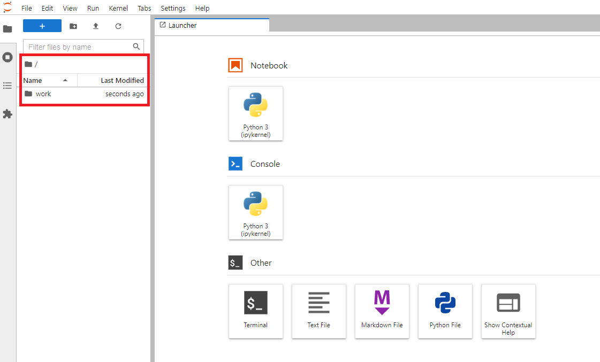 

The jupyter/scipy-notebook image has built-in useful Python libraries such as [requests](https://docs.python-requests.org/en/master/), Matplotlib, Pandas, [NumPy](https://numpy.org/), etc for you. 

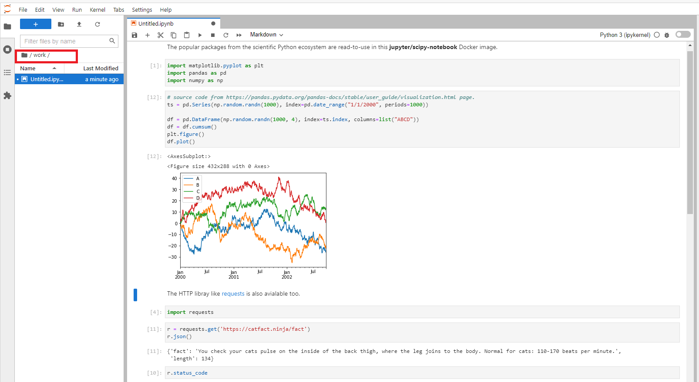 

The files in ```<your working directory>``` folder will be available in the JupyterLab application the next time you start a container, so you can work with your files as a normal JupyterLab/Anaconda environment.

To stop the container, just press Ctrl+c keys to exit the container.

Alternatively, you may just run ```docker stop <container name>``` to stop the container  and ```docker rm <container name>``` command remove the container.

```
docker stop notebook
...
docker rm notebook
```

### <a id="rdpapis_esg"></a>Requesting ESG Data from RDP APIs 

The jupyter/scipy-notebook image is suitable for building a notebook or dashboard with the Refinitiv Data Platform APIs (RDP APIs) content. You can request data from RDP APIs with the HTTP library, perform data analysis and then plot a graph with built-in Python libraries.

#### <a id="whatis_rdp"></a>What is Refinitiv Data Platform (RDP) APIs?

The [Refinitiv Data Platform (RDP) APIs](https://developers.refinitiv.com/en/api-catalog/refinitiv-data-platform/refinitiv-data-platform-apis) provide various Refinitiv data and content for developers via easy to use Web-based API.

RDP APIs give developers seamless and holistic access to all of the Refinitiv content such as Historical Pricing, Environmental Social and Governance (ESG), News, Research, etc and commingled with their content, enriching, integrating, and distributing the data through a single interface, delivered wherever they need it.  The RDP APIs delivery mechanisms are the following:
* Request - Response: RESTful web service (HTTP GET, POST, PUT or DELETE) 
* Alert: delivery is a mechanism to receive asynchronous updates (alerts) to a subscription. 
* Bulks:  deliver substantial payloads, like the end-of-day pricing data for the whole venue. 
* Streaming: deliver real-time delivery of messages.

This example project is focusing on the Request-Response: RESTful web service delivery method only.  

For more detail regarding Refinitiv Data Platform, please see the following APIs resources: 
- [Quick Start](https://developers.refinitiv.com/en/api-catalog/refinitiv-data-platform/refinitiv-data-platform-apis/quick-start) page.
- [Tutorials](https://developers.refinitiv.com/en/api-catalog/refinitiv-data-platform/refinitiv-data-platform-apis/tutorials) page.
- [RDP APIs: Introduction to the Request-Response API](https://developers.refinitiv.com/en/api-catalog/refinitiv-data-platform/refinitiv-data-platform-apis/tutorials#introduction-to-the-request-response-api) page.
- [RDP APIs: Authorization - All about tokens](https://developers.refinitiv.com/en/api-catalog/refinitiv-data-platform/refinitiv-data-platform-apis/tutorials#authorization-all-about-tokens) page.

The example notebook of this scenario is the *rdp_apis_notebook.ipynb* example notebook file in */python/notebook/* folder. The notebook workflow is identical to the example notebook on [my dotenv repository](https://github.com/Refinitiv-API-Samples/Article.RDP.RRTO.Python.Java.DOTENV).  

To run this *rdp_apis_notebook.ipynb* example notebook, you just create a ```.env``` file in */python/* folder with the RDP credentials and endpoints information, and then run jupyter/scipy-notebook image to start a Jupyter server with the following command in */python/* folder.

```
docker run -p 8888:8888 --name notebook -v <project /python/notebook/ directory>:/home/jovyan/work -e JUPYTER_ENABLE_LAB=yes --env-file .env -it jupyter/scipy-notebook:70178b8e48d7
```

The above command started a container name *notebook* and mounted */python/notebook/* folder to container's */home/jovyan/work* directory. Once you have opened the notebook server URL in a web browser, the *rdp_apis_notebook.ipynb* example notebook will be available in the *work* directory of the Jupyter. The rdp_apis_notebook.ipynb example notebook uses the built-in libraries in the image to authenticate with the RDP Auth Service and request Environmental Social and Governance (ESG) data from RDP ESG Service to plot a graph. You can run through each step of the notebook. All activities you have done with the file will be saved for a later run too.

Please see the full detail regarding how to run this example notebook on the [How to run the Jupyter Docker Scipy-Notebook](#scipy_notebook_run) section.

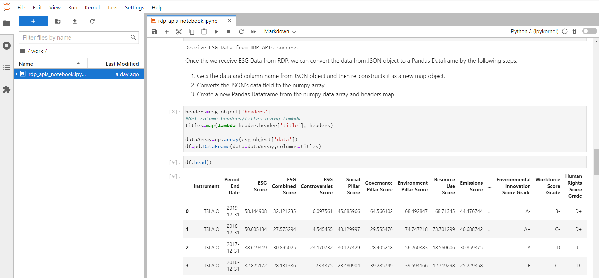 

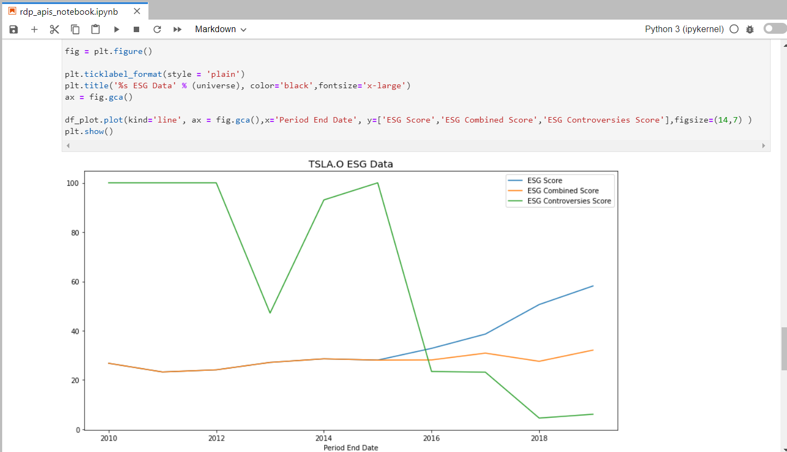

### <a id="notebook_user"></a>How to change Container User

The Jupyter Docker Stacks images are a Linux container that runs the Jupyter server for you. The default notebook user (```nb_user```) of the Jupyter server is always **jovyan** and the home directory is always **home/jovyan**. However, you can change a notebook user to someone else based on your preference via the following container's options.

```
docker run -e CHOWN_HOME=yes --user root -e NB_USER=<User> <project /python/notebook/ directory>:/<User>/jovyan/work
```

Example with *wasinw* user.

```
docker run -p 8888:8888 --name notebook -e CHOWN_HOME=yes --user root -e NB_USER=wasinw -v C:\drive_d\Project\Code\notebook_docker\python\notebook:/home/wasinw/work -e JUPYTER_ENABLE_LAB=yes --env-file .env -it jupyter/scipy-notebook:70178b8e48d7
```
Now the notebook user is *wasinw* and the working directory is */home/wasinw/work* folder.

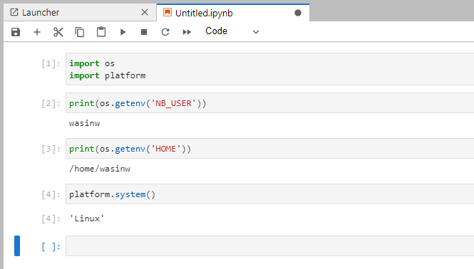 

Please note that this example project uses *jovyan* as a default notebook user.

## <a id="scipy_install_libs"></a>How to use other Python Libraries

If you are using the libraries that do not come with the jupyter/scipy-notebook Docker image such as the [Plotly Python library ](https://plotly.com/python/), you can install them directly via the notebook shell with both pip and conda/mamba tools.

Example with pip:
```
import sys

!$sys.executable -m pip install plotly
```
Example with conda:
```
import sys

!conda install --yes --prefix {sys.prefix} plotly
```
However, this solution installs the package into the currently-running Jupyter kernel which is always destroyed every time you stop a Docker container. A better solution is to create a new Docker image from Jupyter Docker Stacks that contains the required libraries, and then all containers generated from the image can use the libraries without any manual installation. 

The Jupyter Docker Stacks let developers create their Dockerfile with an instruction to install the Python dependencies via mamba, pip, and conda package management tools. Please see more detail on the [Using mamba install or pip install in a Child Docker image](https://jupyter-docker-stacks.readthedocs.io/en/latest/using/recipes.html#using-mamba-install-or-pip-install-in-a-child-docker-image) page.

### <a id="rdplib_plotly"></a>Example with Refinitiv Data via Refinitiv Data Platform Library and Plotly

Let's demonstrate with the [Refinitiv Data Platform Library for Python](https://developers.refinitiv.com/en/api-catalog/refinitiv-data-platform/refinitiv-data-platform-libraries) (RDP Library for Python) and Plotly libraries. 

### <a id="rdplib_intro"></a>Introduction to Refinitiv Data Platform (RDP) Libraries

Refinitiv provides a wide range of contents and data which require multiple technologies, delivery mechanisms, data formats, and multiple APIs to access each content. The [RDP Libraries](https://developers.refinitiv.com/en/api-catalog/refinitiv-data-platform/refinitiv-data-platform-libraries) are a suite of ease-of-use interfaces providing unified access to streaming and non-streaming data services offered within the [Refinitiv Data Platform (RDP)](https://developers.refinitiv.com/en/api-catalog/refinitiv-data-platform/refinitiv-data-platform-apis). The Libraries simplified how to access data to various delivery modes such as Request-Response, Streaming, Bulk File, and Queues via a single library. 

For more deep detail regarding the RDP Libraries, please refer to the following articles and tutorials:
- [Developer Article: Discover our Refinitiv Data Platform Library part 1](https://developers.refinitiv.com/article/discover-our-upcoming-refinitiv-data-platform-library-part-1).
- [Developer Article: Discover our Refinitiv Data Platform Library part 2](https://developers.refinitiv.com/en/article-catalog/article/discover-our-refinitiv-data-platform-library-part-2).
- [Refinitiv Data Platform Libraries Document: An Introduction page](https://developers.refinitiv.com/en/api-catalog/refinitiv-data-platform/refinitiv-data-platform-libraries/documentation).

#### Disclaimer

As this example project has been tested on alpha versions **1.0.0.a10** of the Python library, the method signatures, data formats, etc are subject to change. 

Firstly create a ```requirements.txt``` file in a */python/* folder with the following content:

```
plotly==5.2.2
refinitiv-dataplatform==1.0.0a10
```

Next, create a ```Dockerfile``` file in a */python/* folder with the following content:

```
# Start from a core stack version
FROM jupyter/scipy-notebook:70178b8e48d7

LABEL maintainer="Your name and email address"

# Install from requirements.txt file
COPY --chown=${NB_UID}:${NB_GID} requirements.txt /tmp/
RUN pip install --quiet --no-cache-dir --requirement /tmp/requirements.txt && \
    fix-permissions "${CONDA_DIR}" && \
    fix-permissions "/home/${NB_USER}"

ENV JUPYTER_ENABLE_LAB=yes
```
Please noticed that a Dockerfile set ```ENV JUPYTER_ENABLE_LAB=yes``` environment variable, so all containers that are generated from this image will run the JupyterLab application by default. 

And then build a Docker image name *jupyter_rdp_plotly* with the following command:

```
docker build . -t jupyter_rdp_plotly
```

Once the Docker image is built successfully, you can the following command to starts a container running a Jupyter Notebook server with all Python libraries that are defined in a ```requirements.txt``` file and *jupyter/scipy-notebook* in your machine.

```
docker run -p 8888:8888 --name notebook -v <project /python/notebook/ directory>:/home/jovyan/work --env-file .env -it jupyter_rdp_plotly
```

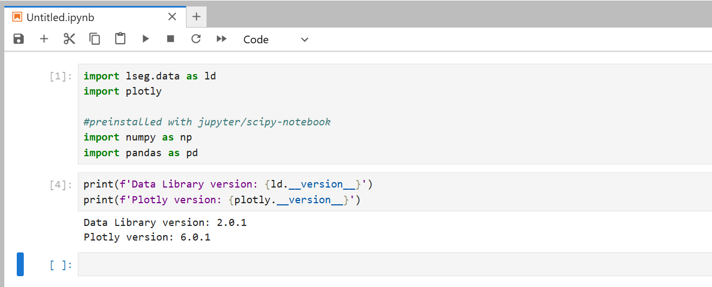 

Please noticed that all credentials have been passed to the Jupyter server's environment variables via Docker run ```-env-file .env``` option, so the notebook can access those configurations via ```os.getenv()``` method. Developers do not need to keep credentials information in the notebook source code.

Then you can start to create notebook applications that consume content from Refinitiv with the RDP Library API, and then plot data with the Plotly library. Please see more detail in the *rdp_library_plotly_notebook.ipynb* example notebook file in */python/notebook/* folder. Please see the full detail regarding how to run this example notebook on the [How to build and run the Jupyter Docker Scipy-Notebook customize's image with RDP Library for Python and Plotly](#scipy_notebook_build) section.

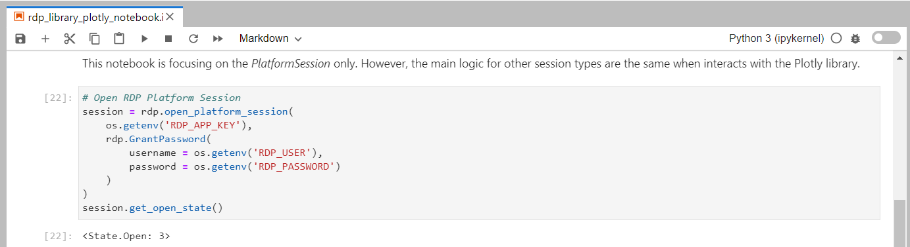 

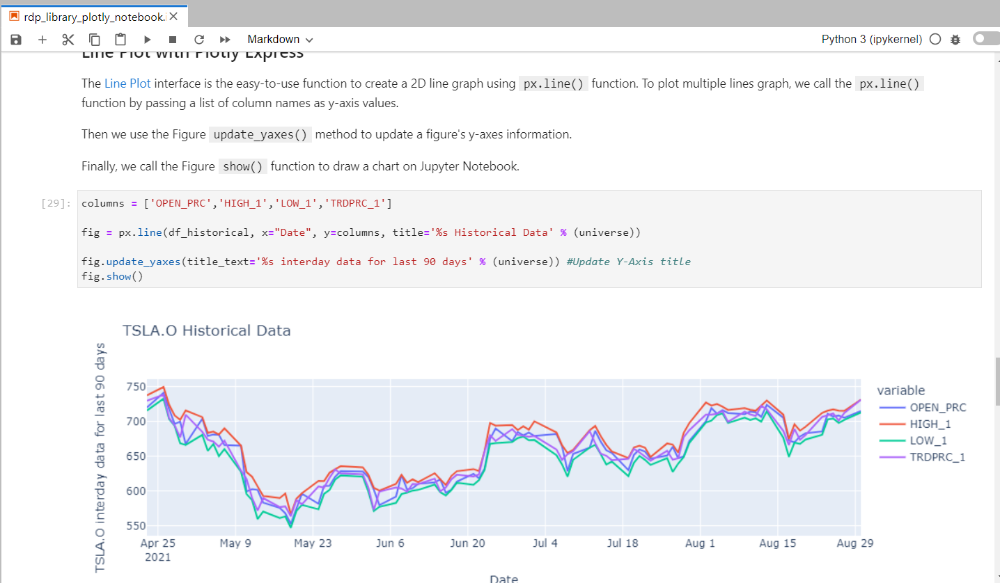 

**Caution**: You *should add* ```.env``` (and ```.env.example```), Jupyter checkpoints, cache, config, etc. file to the ```.dockerignore``` file to avoid adding them to a public Docker Hub repository.

## <a id="r_notebook_intro"></a>Running the Jupyter Docker R-Notebook Image

If you are using [R programming language](https://www.r-project.org/) in your Data Science or Finance/Statistic works, Jupyter Docker Stacks provide [jupyter/r-notebook](https://jupyter-docker-stacks.readthedocs.io/en/latest/using/selecting.html#jupyter-r-notebook) Docker image for you. You can pull a jupyter/r-notebook image starts a container running a Jupyter Notebook server with the [R kernel](https://irkernel.github.io/) via a single command.

```
docker run -p 8888:8888 --name notebook -v <your working directory>:/home/jovyan/work -e JUPYTER_ENABLE_LAB=yes -it jupyter/r-notebook:70178b8e48d7
```
The above command set the following container's options:
- ```-p 8888:8888```: Exposes the server on host port 8888
- ```-v <your working directory>:/home/jovyan/work```: Mounts the working directory on the host as /home/jovyan/work folder in the container to save the files between your host machine and a container.
- ```-e JUPYTER_ENABLE_LAB=yes```: Run JupyterLab instead of the default classic Jupyter Notebook.
- ```--name notebook```: Define a container name as *notebook*
- ```-it```: enable interactive mode with a pseudo-TTY when running a container

The running result with the notebook server URL information is the following (same as other Jupyter Docker Stacks above).

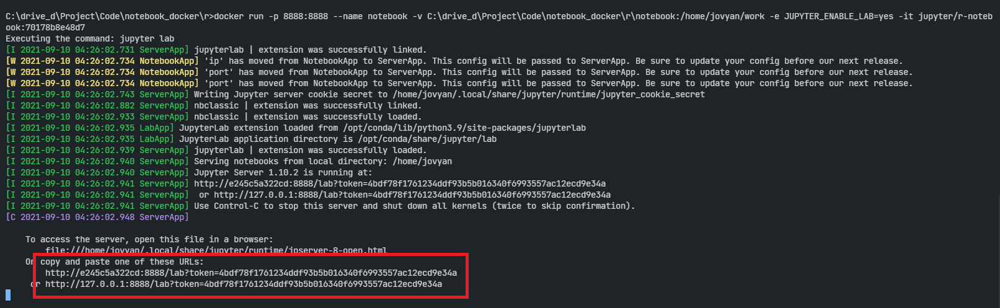 

You can access the JupyterLab application by opening the notebook server URL in your browser. It starts with the */home/jovyan/* location. 

This JupyterLab application comes with both Python and R kernels for the notebook application. 

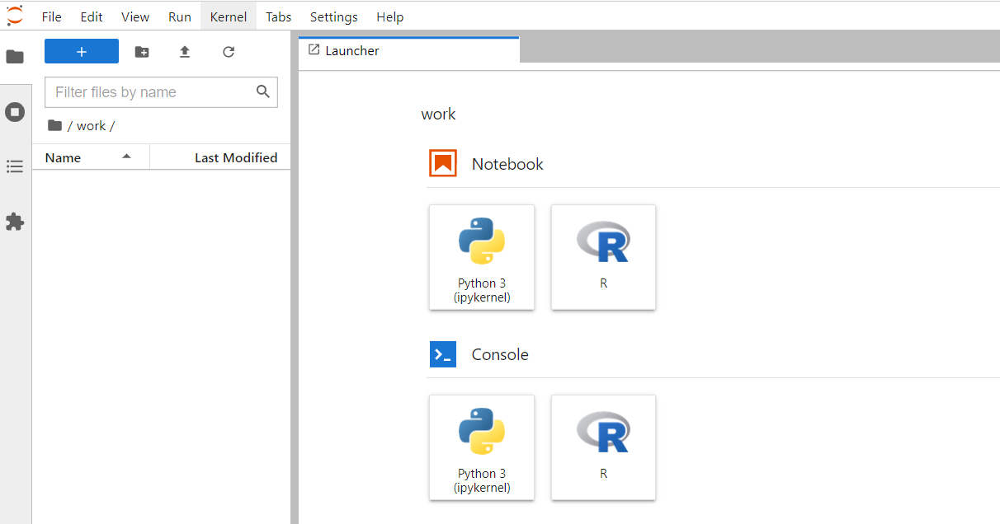

The jupyter/r-notebook Docker image comes with pre-installed popular R packages for HTTP REST API, JSON, plotting a basic graph, and other operations too.

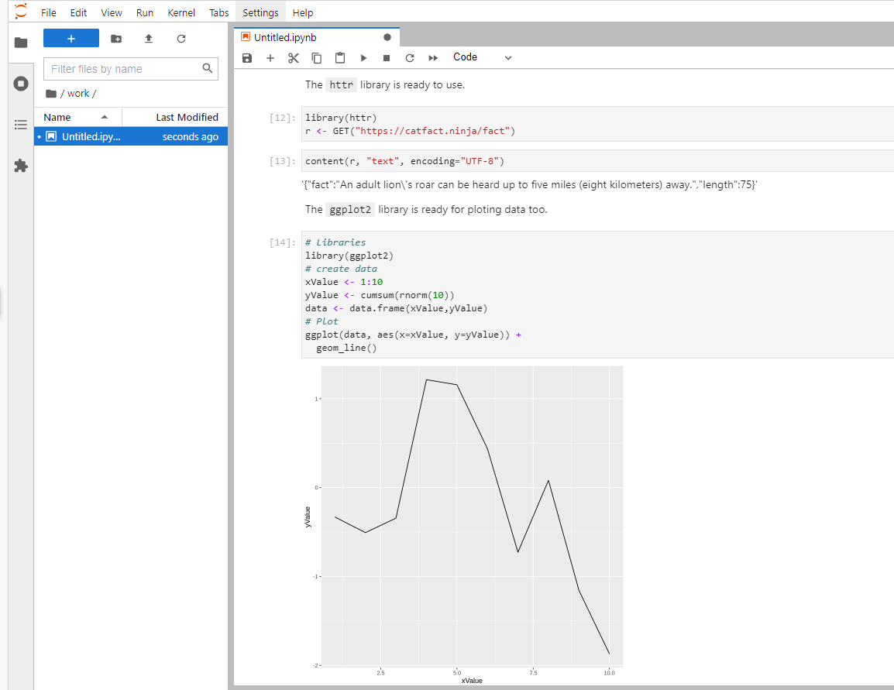

Please note that only the notebooks and files in the */home/jovyan/* folder can be saved to the host machine (your ```<your working directory>``` folder). 

To stop the container, just press Ctrl+c keys to exit the container.

Alternatively, you may just run ```docker stop <container name>``` to stop the container  and ```docker rm <container name>``` command remove the container.

```
docker stop notebook
...
docker rm notebook
```

With the pre-installed R Data Science and development packages, developers are ready to build a notebook or dashboard with the RDP APIs (or other Refinitiv HTTP REST APIs) content. You can request data from Refinitiv with the HTTP library, perform data analysis and then plot a graph for data visualization.

## <a id="r_install_libs"></a>How to use other R Libraries

If you are using the libraries that do not come with the jupyter/r-notebook Docker image such as the [Plotly R library ](https://plotly.com/r/), you can install them directly via the notebook shell with the following command.

```
install.packages("plotly")
```
However, this solution installs the package into the currently-running Jupyter kernel which is always destroyed every time you stop a Docker container. 

A better solution is to create a new Docker image from Jupyter Docker Stacks that contains the required libraries, and then all containers generated from the image can use the libraries without any manual installation. Like the other Jupyter Docker Stacks, developers can create their Dockerfile with an instruction to install R packages on top of the jupyter/r-notebook image.

### <a id="r_rdpapi_plotly"></a>Example with Refinitiv Data APIs and Plotly on R-Notebook

Let's demonstrate by building a Docker image that included the Plotly library, and then run the R notebook application that retrieves historical data from APIs, and draws charts with the Plotly R library.

Firstly, create a ```Dockerfile``` file in a */r/* folder with the following content:

```
# Start from a core stack version
FROM jupyter/r-notebook:70178b8e48d7

LABEL maintainer="Your name and email address"

# Install package
RUN R -e "install.packages('plotly', repos='http://cran.rstudio.com/')"

ENV JUPYTER_ENABLE_LAB=yes
```
And then build a Docker image name *jupyter_rdp_r_plotly* with the following command:

```
docker build . -t jupyter_rdp_r_plotly
```

Once the Docker image is built successfully, you can the following command to starts a container running a Jupyter R Notebook server with the Plotly R library and  *jupyter/r-notebook* in your machine.

```
docker run -p 8888:8888 --name notebook -v <project /r/notebook/ directory>:/home/jovyan/work --env-file .env -it jupyter_rdp_r_plotly
```
Then you can start to create notebook applications with R language to consume Refinitiv content via the RDP APIs HTTP REST, and then plot data with the Plotly library. Please see more detail in the *rdp_library_plotly_notebook.ipynb* example notebook file in */r/notebook/* folder. 
this example notebook is based on the *RDPHistoricalRExample.ipynb* example of [Setup Jupyter Notebook for R](https://developers.refinitiv.com/en/article-catalog/article/setup-jupyter-notebook-r) ([GitHub](https://github.com/Refinitiv-API-Samples/Example.RefinitivAPIs.R.Jupyter)) with some modifications to match the Jupyter Docker scenario.

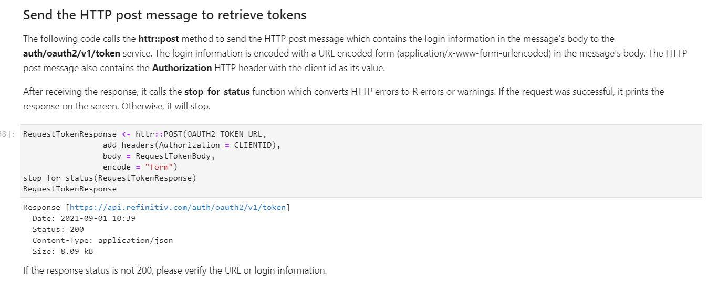 

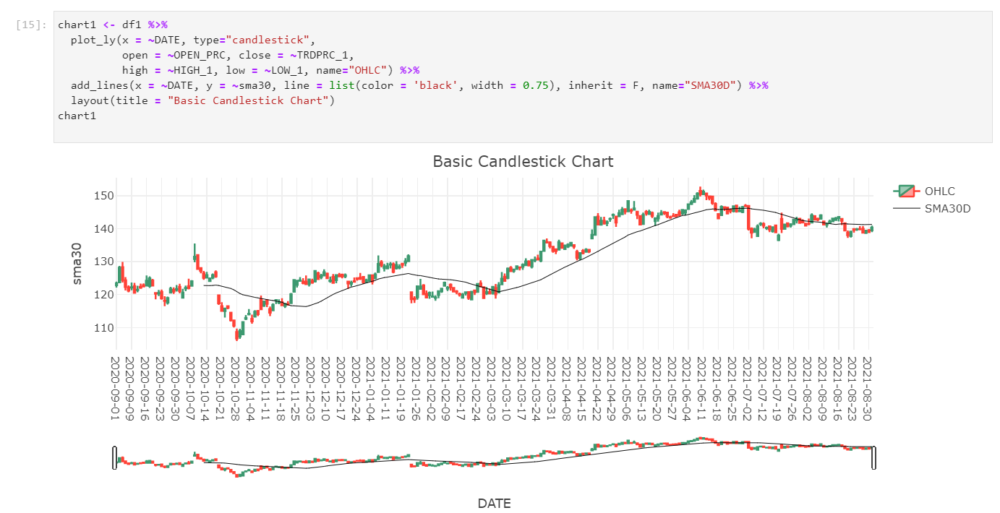 

You can find a full detail regarding how to run this example notebook on the [How to build and run the Jupyter Docker R-Notebook customize the image with Plotly](#r_notebook_build) section.

## <a id="dapi_usercase"></a>What if I use Eikon Data API

If you are using the [Eikon Data API](https://developers.refinitiv.com/en/api-catalog/eikon/eikon-data-api) (aka DAPI), the Jupyter Docker Stacks are not for you. The Refinitiv Workspace/Eikon application integrates a Data API proxy that acts as an interface between the Eikon Data API Python library and the Eikon Data Platform. For this reason, the Refinitiv Workspace/Eikon application must be running in the same machine that running the Eikon Data API, and the Refinitiv Workspace/Eikon application does not support Docker.

However, you can access the [*CodeBook*](https://www.refinitiv.com/en/products/codebook), the cloud-hosted Jupyter Notebook development environment for Python scripting from the application. The CodeBook is natively available in Refinitiv Workspace and Eikon as an app (**no installation required!!**), providing access to Refinitiv APIs and other popular Python libraries that are already pre-installed on the cloud. The list of pre-installed libraries is available in the Codebook's *Libraries&Extensions.md* file.

Please see more detail regarding the CodeBook app in this [Use Eikon Data API or RDP Library in Python in CodeBook on Web Browser article](https://developers.refinitiv.com/en/article-catalog/article/use-eikon-data-api-or-rdp-library-python-codebook-web-browser).

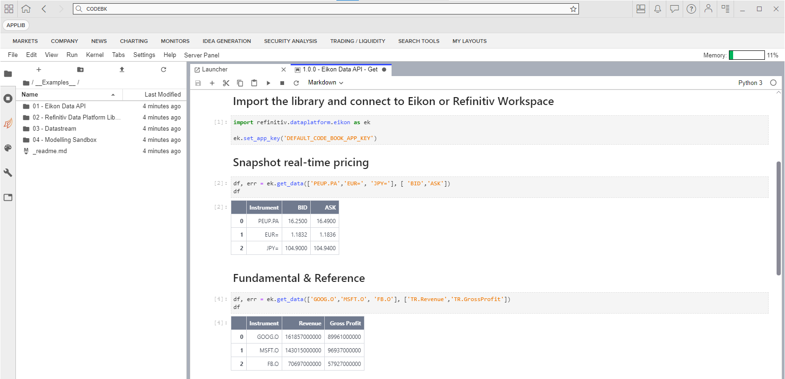 

## <a id="prerequisite"></a>Demo prerequisite
This example requires the following dependencies software and libraries.
1. RDP Access credentials.
2. [Docker Desktop/Engine](https://docs.docker.com/get-docker/) version 20.10.x
3. [DockerHub](https://hub.docker.com/) account (free subscription).
4. Internet connection. 

Please contact your Refinitiv's representative to help you to access the RDP account and services. You can find more detail regarding the RDP access credentials set up from the *Getting Started for User ID* section of [Getting Start with Refinitiv Data Platform article](https://developers.refinitiv.com/en/article-catalog/article/getting-start-with-refinitiv-data-platform) article:

##  <a id="project_files"></a>Project files
This example project contains the following files and folders
1. *python/* folder: The Jupyter Notebook for RDP APIs/RDP Library for Python with jupyter scipy-notebook, contains example notebooks, configurations, and Docker files.
2. *r/* folder: The Jupyter Notebook for RDP APIs/with jupyter r-notebook, contains example notebooks, and Docker files.
3. *.env.example*: The example of ```.env``` file structure.
4. *images*: Project images folder.
5. *LICENSE.md*: Project's license file.
6. *README.md*: Project's README file.

## <a id="how_to_run"></a>How to run the Examples

The first step is to unzip or download the example project folder into a directory of your choice, then set up Python or R Docker environments based on your preference.

**Caution**: You *should not* share a ```.env``` file to your peers or commit/push it to the version control. You should add the file to the ```.gitignore``` file to avoid adding it to version control or public repository accidentally.

### <a id="scipy_notebook_run"></a>How to run the Jupyter Docker Scipy-Notebook
1. Firstly, open the project folder in the command prompt and go to the *python* subfolder
2. Create a file name ```.env``` in that folder with the following content:
    ```
    # RDP Core Credentials
    RDP_USER=<Your RDP User>
    RDP_PASSWORD=<Your RDP Password>
    RDP_APP_KEY=<Your RDP App Key>

    # RDP Core Endpoints
    RDP_BASE_URL=https://api.refinitiv.com
    RDP_AUTH_URL=/auth/oauth2/v1/token
    RDP_ESG_URL=/data/environmental-social-governance/v2/views/scores-full
    ```
3. Run the following [Docker run](https://docs.docker.com/engine/reference/run/) command in a command prompt to pull Jupyter Docker Scipy-Notebook image and run its container
    ```
    docker run -p 8888:8888 --name notebook -v <project /python/notebook/ directory>:/home/jovyan/work -e JUPYTER_ENABLE_LAB=yes --env-file .env -it jupyter/scipy-notebook:70178b8e48d7
    ```
4. The Jupyter Docker Scipy-Notebook will run the Jupyter server and print the server URL in a console. 
5. Open the notebook server URL in your browser, the web browser will start the JupyterLab application.
6. Open the work folder and open *rdp_apis_notebook.ipynb* example notebook file, then run through each notebook cell.

    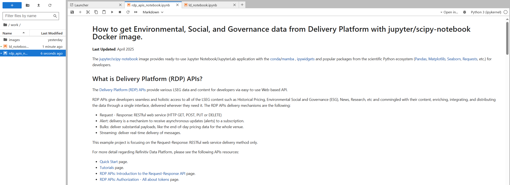 

### <a id="scipy_notebook_build"></a>How to build and run the Jupyter Docker Scipy-Notebook customized image with RDP Library for Python and Plotly
1. Firstly, open the project folder in the command prompt and go to the *python* subfolder
2. Create a file name ```.env``` in that folder with the following content. You can skip this step if you already did it in the Scipy-Notebook run section above.
    ```
    # RDP Core Credentials
    RDP_USER=<Your RDP User>
    RDP_PASSWORD=<Your RDP Password>
    RDP_APP_KEY=<Your RDP App Key>
    ```
3. Run the following [Docker build](https://docs.docker.com/engine/reference/commandline/build/) command to build the Docker Image name *jupyter_rdp_plotly*:
    ```
    docker build . -t jupyter_rdp_plotly
    ```
4. Once Docker build the image success, run the following command to start a container
    ```
    docker run -p 8888:8888 --name notebook -v <project /python/notebook/ directory>:/home/jovyan/work --env-file .env -it jupyter_rdp_plotly
    ```
5. The jupyter_rdp_plotly container will run the Jupyter server and print the server URL in a console. 
6. Open the notebook server URL in your browser, the web browser will start the JupyterLab application.
7. Open the work folder and open *rdp_library_plotly_notebook.ipynb* example notebook file, then run through each notebook cell.

    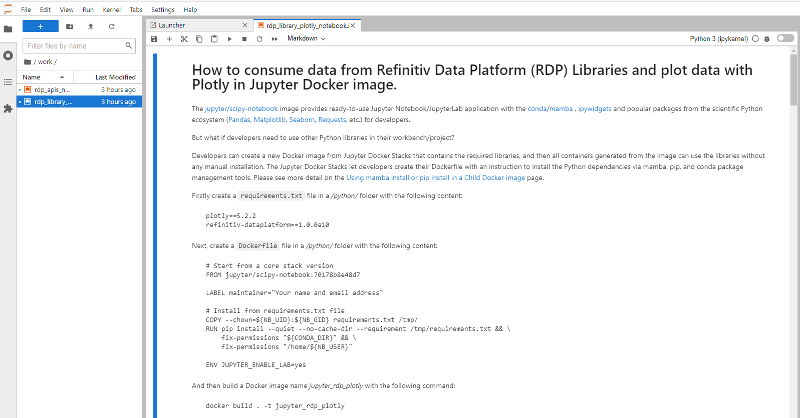

### <a id="r_notebook_build"></a>How to build and run the Jupyter Docker R-Notebook customized image with Plotly
1. Firstly, open the project folder in the command prompt and go to the *r* subfolder
2. Create a file name ```.env``` in that folder with the following content. You can skip this step if you already did it in the Scipy-Notebook run section above.
    ```
    # RDP Core Credentials
    RDP_USER=<Your RDP User>
    RDP_PASSWORD=<Your RDP Password>
    RDP_APP_KEY=<Your RDP App Key>

    # RDP Core Endpoints
    RDP_BASE_URL=https://api.refinitiv.com
    RDP_AUTH_URL=/auth/oauth2/v1/token
    RDP_ESG_URL=/data/environmental-social-governance/v2/views/scores-full
    RDP_HISTORICAL_PRICE_URL=/data/historical-pricing/v1
    RDP_HISTORICAL_INTERDAY_SUMMARIES_URL=/views/interday-summaries/
    RDP_HISTORICAL_EVENT_URL=/views/events/
    ```
3. Run the following [Docker build](https://docs.docker.com/engine/reference/commandline/build/) command to build the Docker Image name *jupyter_rdp_r_plotly*:
    ```
    docker build . -t jupyter_rdp_r_plotly
    ```
4. Once Docker build the image success, run the following command to start a container
    ```
    docker run -p 8888:8888 --name notebook -v <project /r/notebook/ directory>:/home/jovyan/work --env-file .env -it jupyter_rdp_r_plotly
    ```
5. The jupyter_rdp_r_plotly container will run the Jupyter server and print the server URL in a console. 
6. Open the notebook server URL in your browser, the web browser will start the JupyterLab application.
7. Open the work folder and open *rdp_apis_r_plotly_notebook.ipynb* example notebook file, then run through each notebook cell.

    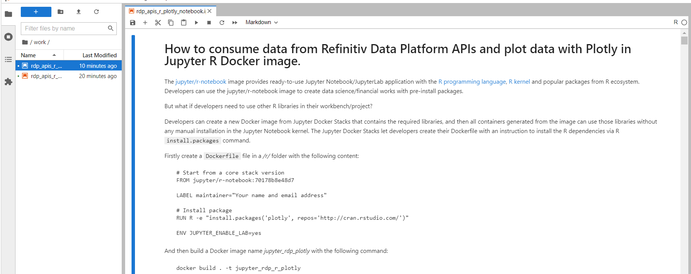

## <a id="conclusion"></a>Conclusion

Docker is an open containerization platform for developing, testing, deploying, and running any software application. The Jupyter Docker Stacks provide a ready-to-use and consistent development environment for Data Scientists, Financial coders, and their teams. Developers do not need to set up their environment/workbench (Anaconda, Virtual Environment, Jupyter installation, etc.) manually which is the most complex task for them anymore. Developers can just run a single command to start the Jupyter notebook server from Jupyter Docker Stacks and continue their work.

The Jupyter Docker Stacks already contain a handful of libraries for Data Science/Financial development for various requirements (Python, R, Machine Learning, and much more). If developers need additional libraries, Jupyter Docker Stacks let developers create their Dockerfile with an instruction to install those dependencies. All containers generated from the customized image can use the libraries without any manual installation. 


## <a id="references"></a>References

You can find more details regarding the Refinitiv Data Platform Libraries, Plotly, Jupyter Docker Stacks, and related technologies for this notebook from the following resources:
* [Refinitiv Data Platform (RDP) Libraries](https://developers.refinitiv.com/en/api-catalog/refinitiv-data-platform/refinitiv-data-platform-libraries) on the [Refinitiv Developer Community](https://developers.refinitiv.com/) website.
* [RDP Libraries Quick Start Guide page](https://developers.refinitiv.com/en/api-catalog/refinitiv-data-platform/refinitiv-data-platform-libraries/quick-start).
* [RDP Libraries Tutorial page](https://developers.refinitiv.com/en/api-catalog/refinitiv-data-platform/refinitiv-data-platform-libraries/tutorials).
* [Discover our Refinitiv Data Platform Library (part 1)](https://developers.refinitiv.com/en/article-catalog/article/discover-our-refinitiv-data-platform-library-part-1).
* [Discover our Refinitiv Data Platform Library (part 2)](https://developers.refinitiv.com/en/article-catalog/article/discover-our-refinitiv-data-platform-library-part-2).
* [Plotly Official page](https://plotly.com/).
* [Plotly Python page](https://plotly.com/python/).
* [Plotly Express page](https://plotly.com/python/plotly-express/)
* [Plotly Graph Objects page](https://plotly.com/python/graph-objects/)
* [Jupyter Docker Stacks page](https://jupyter-docker-stacks.readthedocs.io/en/latest/index.html)
* [Jupyter Docker Stack on DockerHub](https://hub.docker.com/u/jupyter) website.
* [Setup Jupyter Notebook for R article](https://developers.refinitiv.com/en/article-catalog/article/setup-jupyter-notebook-r).
* [An Introduction to Docker for R Users](https://colinfay.me/docker-r-reproducibility/).

For any questions related to Refinitiv Data Platform or Refinitiv Data Platform Libraries, please use the following forums on the [the Developers Community Q&A page](https://community.developers.refinitiv.com/).
- [RDP APIs Forum](https://community.developers.refinitiv.com/spaces/231/index.html).
- [Refinitiv Data Platform Libraries Forum](https://community.developers.refinitiv.com/spaces/321/refinitiv-data-platform-libraries.html).